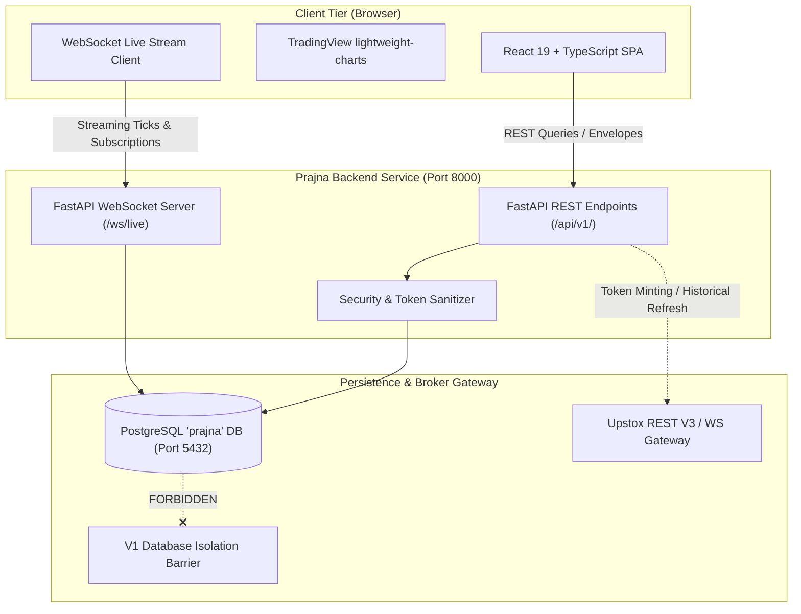
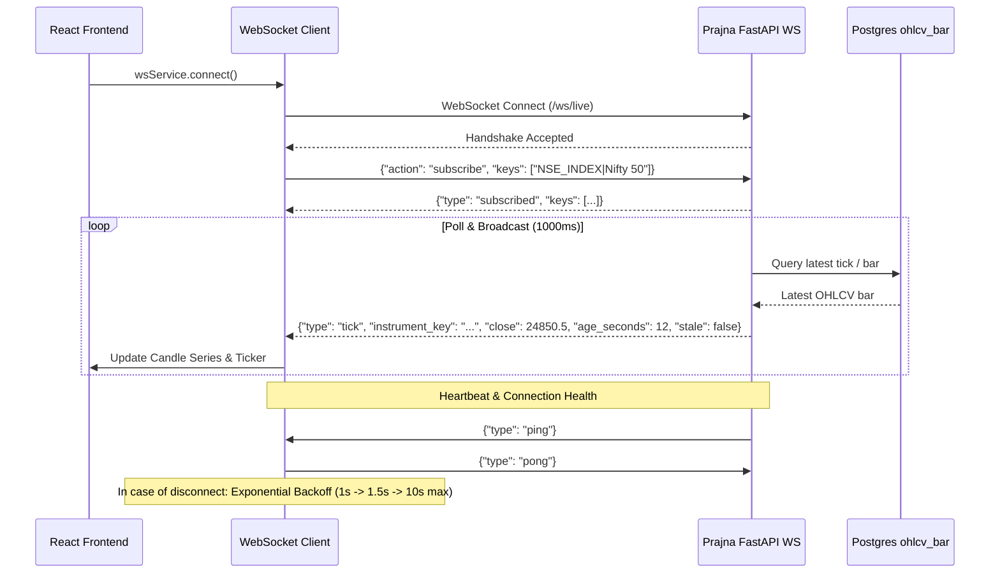

# Prajna Trading Intelligence Dashboard — Frontend Architecture

**System**: Prajna AI Trading System (AutoTrade Pro V2)  
**Version**: 2.0.0-PROD  
**Document**: `docs/FRONTEND_ARCHITECTURE.md`  
**Classification**: Production Architecture & UI Contract  

---

## 1. System Overview & Technology Stack

The Prajna Trading Intelligence Dashboard is a production-grade, real-time trading frontend built to provide operators, risk managers, and quantitative analysts with deep observability, market intelligence, Point-in-Time (PIT) chart analytics, and pipeline telemetry for the National Stock Exchange of India (NSE).



### Core Technologies
- **Framework**: React 19 + TypeScript (`strict: true`, ES2023)
- **Bundler & Tooling**: Vite 8 with Rollup bundling
- **Styling**: Tailwind CSS v4 (`@tailwindcss/vite`) with dark financial palette (`slate-950`, `slate-900`, `slate-800`, `indigo-500`, `emerald-500`, `amber-500`, `rose-500`)
- **Charting Engine**: TradingView `lightweight-charts` v5.2.1 (Hardware-accelerated HTML5 Canvas)
- **Icons**: `lucide-react`
- **Data Protocols**: JSON API Envelopes over HTTP/2 + WebSocket binary/JSON streaming

---

## 2. Security & Isolation Architecture

### 2.1 Zero-Credential Frontend Guarantee
In strict compliance with Prajna V2 Security Mandates:
1. **Zero Upstox Secrets**: Neither `UPSTOX_ACCESS_TOKEN`, `UPSTOX_API_SECRET`, `UPSTOX_TOTP_SECRET`, nor `UPSTOX_PIN` are ever packaged in client JavaScript bundles, exposed in DOM attributes, sent via URL query parameters, or stored in `localStorage` or `sessionStorage`.
2. **Reverse Proxy & Backend Gateway**: All broker interaction is brokered exclusively by the Python backend. The frontend communicates solely with `/api/v1/` and `/ws/live`.
3. **Database Isolation**: The backend enforces runtime proof that the connection role `prajna_rw` holds no privileges on the legacy `autotrade_pro` (V1) database. Engine construction raises `DatabaseIsolationError` if any DSN targets V1.
4. **Token Fingerprinting**: The System Health view exposes only a masked cryptographic fingerprint (e.g., `eyJ...4a89`) and the minted age of active tokens. Full token strings are never serialized.

---

## 3. Component Hierarchy & Core Views

The application implements 12 distinct functional modules coordinated via `App.tsx` and navigated using `Navbar.tsx`:

```
App.tsx
├── Navbar.tsx (Global navigation, IST clock, Market session pill, WS link status, Stage 3 lock pill)
├── 1. OverviewDashboard.tsx (Macro indices, market status, global benchmarks, freshness, top news)
├── 2. StockExplorer.tsx (NSE active universe, SCD2 validity drawer, search, sector filters)
├── 3. CandleChart.tsx (TradingView candlesticks & volume, 1m/15m/1h/1D, PIT adjustment toggle, live ticks)
├── 4. TechnicalDataView.tsx (OHLC, volume, day range, average price; Stage 3 indicators locked)
├── 5. FundamentalsView.tsx (Key valuation ratios, income/balance sheet statements, corporate action ledger)
├── 6. GlobalMarketsView.tsx (13 global benchmarks, P5 Global Finality badges, withheld bar counts)
├── 7. NewsIntelligenceView.tsx (News feed with published/received/processed timestamps, latency, no synthetic sentiment)
├── 8. StockScreener.tsx (Universe filtering on price, P/E, sector, volume; Stage 3/4/5 columns locked)
├── 9. SignalsView.tsx (UI Contract only; displays explicit STAGE_3_LOCKED notice)
├── 10. PortfolioView.tsx (UI Contract only; displays explicit STAGE_4_5_LOCKED notice)
├── 11. SystemHealthView.tsx (Diagnostics across 8 subsystems, token age, acceptance matrix)
└── 12. AdminOpsView.tsx (Ingest runs ledger, anomalies, data revisions, verified backups, warmup planner)
```

---

## 4. Real-Time Streaming & WebSocket Architecture

The WebSocket architecture (`frontend/src/services/websocket.ts`) connects to `/ws/live` and provides resilient bidirectional synchronization:



### Fault-Tolerant Behaviors:
- **Exponential Reconnection**: Upon network severance, the client automatically attempts reconnection with exponential backoff capped at 10 seconds.
- **Dynamic Subscription Resubmission**: On reconnection, previously subscribed instrument keys are automatically re-registered with the server without user intervention.
- **Stale Tick Detection**: Each tick payload carries `age_seconds` and `stale: boolean`. If the elapsed time between bar timestamp and wall-clock exceeds 2.5x the bar timeframe, the UI renders an amber warning pill indicating data staleness.

---

## 5. Timezone & Temporal Integrity

In quantitative trading, conflating trading dates with calendar dates or mixing UTC and IST causes severe look-ahead bias and data corruption. The frontend enforces strict temporal separation:

1. **IST Primary Display**: All UI clocks, market session badges, trading dates, and bar timestamps are rendered in Indian Standard Time (`Asia/Kolkata`, UTC+05:30).
2. **UTC Storage & Metadata**: Ingestion timestamps (`received_at`, `processed_at`), database timestamps, and API envelopes serialize ISO 8601 UTC strings (`YYYY-MM-DDTHH:MM:SSZ`).
3. **IST/UTC Chart Switcher**: The candlestick chart features an instantaneous toggle allowing quantitative researchers to inspect candles in either IST or UTC.
4. **Market Session State Machine**:
   - `OPEN`: Monday through Friday, 09:15 to 15:30 IST.
   - `CLOSED`: Outside trading hours or weekends/exchange holidays.

---

## 6. Point-in-Time (PIT) Corporate Action Adjustments

In `frontend/src/components/Chart/CandleChart.tsx`:
- Users can toggle between **Unadjusted (Raw Market)** and **Adjusted (Point-in-Time)** prices.
- When toggled, the chart queries `/api/v1/candles/{key}?adjusted=true`.
- The backend serves adjusted prices computed from `pit.bars_adjusted` using validated split and bonus factors from `ca_factor` where `status = 'VERIFIED'`.
- This ensures that technical indicators and visual inspections do not introduce revision survivorship bias.

---

## 7. Stage Gate Enforcement & UI Contracts

The frontend maintains strict compliance with system development gates:
- **Stage 3 (Alpha Modeling & Prediction)**: All indicators (EMA, RSI, MACD, AI momentum, alpha signals) display explicit `"Not available — Stage 3 locked"` badges. The Signals view displays a compliance notice explaining that predictive models are locked until Stage 1 and Stage 2 gates are officially resolved.
- **Stage 4 & 5 (Portfolio & Execution)**: The Portfolio view displays an immutable `"STAGE_4_5_LOCKED"` compliance state. Order execution buttons and live broker routing are strictly disabled.
