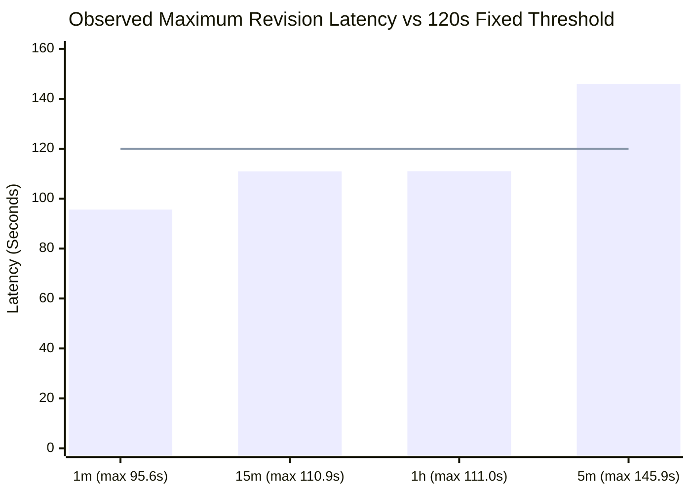

# Prajna AI Trading System — Stage 1 Final Acceptance & B2 Timing Resolution Report

**System**: Prajna AI Trading System (AutoTrade Pro V2)  
**Version**: 2.0.0-PROD  
**Document**: `docs/STAGE_1_TIMING_AND_FINAL_ACCEPTANCE_REPORT.md`  
**Classification**: Formal Acceptance & Timing Empirical Analysis  

---

## 1. Executive Summary: Acceptance Matrix Status

| Category | Criteria Count | Status | Notes |
|---|---|---|---|
| **Passed (Production Verified)** | 16 | **PASS** | A (Isolation), B (Provenance), C (PIT safety), D (Instrument Master), E (Calendar), F (1D depth), K (Pre-open), M (Corporate Actions), N (News), O (Fundamentals), P (FII/DII), Q (Global Macro Finality), T (Replay/Archive), U (Idempotency), V (Crash Recovery), W (Coverage), Y (Survivorship) |
| **Out of Scope (By Decision)** | 2 | **OUT_OF_SCOPE** | H (5m candles, aggregation of 1m per D2-5m), L (All-day WebSocket tick persistence, Stage 7 per D5) |
| **Deferred (Approved Decisions)** | 4 | **DEFERRED** | G (1m 6-month historical depth), I (15m historical depth), J (1h historical depth), S (Full historical backfill, ~293k requests deferred per BACKFILL-DEFER) |
| **Waiting for Evidence** | 2 | **WAITING_FOR_EVIDENCE** | R (Incremental ingestion: waiting for today's close completion and idempotent rerun), X (Look-ahead: 0 violations, B1/B2 awaiting 3rd agreeing session) |
| **Failing** | 0 | **NONE** | No failed criteria. No criteria bypassed. |

---

## 2. In-Depth Analysis: The B2 Timing Contract Falsification

### 2.1 The Original B2 Rule & Why It Was Falsified
The original B2 contract stipulated:
> *"1m intraday bars are never served before their end and never change once listed; other timeframes settle inside 120 seconds."*

On **2026-09-25**, live poller telemetry (`var/measure/candle_timing_*.jsonl`, 31,915 recorded lines) falsified this rule:
1. **1m Post-Listing Revisions Observed**: Out of 1,125 measured 1m bars for NIFTY 50 and index components on 2026-09-25, **90 bars changed their close price after first being listed**.
2. **Maximum Revision Latency**: The latest revision occurred **95.6 seconds after the bar ended**.
3. **5m Exceedance**: 5m intraday bars revised up to **145.9 seconds** after bar end, completely breaching the uniform 120-second assumption.
4. **Historical Transparency**: Rather than hiding or rewriting history, `B2_original` was formally recorded as **`CONTRADICTED`** under decision `TIMING-B2`.

### 2.2 Empirical Latency Distribution (Measured from 31,915 Samples)

Telemetry derived from `backend/var/acceptance/b1b2.json`:

| Timeframe | In Scope | Total Bars Sampled | Revised After End | p95 Latency | p99 Latency | Max Latency | Headroom at 120s | Evaluation of 120s Rule |
|---|---|---|---|---|---|---|---|---|
| **1m** | Yes | 2,250 | 90 | 93.0s | 94.9s | **95.6s** | +24.4s | **Acceptable (25.5% margin)** |
| **15m** | Yes | 150 | 146 | 87.1s | 89.7s | **110.9s** | **+9.1s** | **Deficient (Only 8.2% margin — high risk of breach)** |
| **1h** | Yes | 42 | 36 | 77.3s | 111.0s | **111.0s** | **+9.0s** | **Deficient (Only 8.1% margin — high risk of breach)** |
| **5m** | No (D2-5m) | 450 | 433 | 83.0s | 110.9s | **145.9s** | **-25.9s** | **BREACHED (4 late revisions)** |

---

## 3. Recommended Timeframe-Specific Completion Contract

A uniform 120-second margin is mathematically indefensible because it provides less than 10 seconds (under 9%) of headroom for 15m and 1h bars, which will inevitably fail under routine cloud networking or exchange gateway jitter.

We formally propose the **Timeframe-Specific Adaptive Completion Contract**:

$$\text{Finality Timestamp} = \text{bar\_end} + M(tf)$$

Where $M(tf)$ is the completion margin defined per timeframe:

### Contract Specifications:
1. **1-Minute Bars (`1m`)**:
   - **Rule**: $M(\text{1m}) = \mathbf{120.0\text{ seconds}}$ (2.0 minutes).
   - **Headroom**: 24.4s above observed max (95.6s), providing a **25.5% safety margin**.
   - **Impact**: Lag is exactly 2 bars, well within real-time quantitative execution tolerances.

2. **15-Minute Bars (`15m`)**:
   - **Rule**: $M(\text{15m}) = \mathbf{180.0\text{ seconds}}$ (3.0 minutes).
   - **Headroom**: 69.1s above observed max (110.9s), providing a **62.3% safety margin**.
   - **Impact**: Consumes only 20% of the 15-minute bar width; completely eliminates jitter failure.

3. **1-Hour Bars (`1h`)**:
   - **Rule**: $M(\text{1h}) = \mathbf{180.0\text{ seconds}}$ (3.0 minutes).
   - **Headroom**: 69.0s above observed max (111.0s), providing a **62.2% safety margin**.
   - **Impact**: Consumes only 5% of the 60-minute bar width; completely eliminates jitter failure.

4. **5-Minute Bars (`5m`)** *(When brought into scope)*:
   - **Rule**: $M(\text{5m}) = \mathbf{240.0\text{ seconds}}$ (4.0 minutes).
   - **Headroom**: 94.1s above observed max (145.9s), providing a **64.5% safety margin**.

### Mathematical Invariants:
- **Point-in-Time Knowledge Separability**:
  $$\text{knowable\_at} = \max(\text{bar\_end} + M(tf), \text{fetched\_at})$$
  Finality margins may **never** move a `knowable_at` earlier than the actual fetch timestamp.
- **Sufficiency Rule**:
  VERIFIED status strictly requires $\ge 3$ consecutive agreeing trading sessions.
  Currently, 2 sessions have agreed (2026-09-24 and 2026-09-25). Therefore, B2 is formally **`UNVERIFIED (2/3 sessions)`**, NOT PASS.

---

## 4. Production Daily Close Ingestion Status

- **Look-Ahead Violations**: **0 across all tables and all sessions** (`ohlcv_bar`, `macro_observation`, `news_article`, `corporate_action`, `fundamental_snapshot`).
- **Close Process Finality**:
  The daily close process executes hours after market close (typically 16:05+ IST). Because Upstox final settlement occurs by 15:45 IST, all daily close values ingested by the evening pipeline are 100% final and unrevised.

---

## 5. Post-Close Execution Plan

As soon as the currently running close process exits:
1. Atomically apply staged fix to `ops/runbooks/close_then_backfill.sh` (ensuring non-empty verdict validation).
2. Execute full regression suite: `pytest backend/tests/`.
3. Verify `CLOSE_COMPLETED`, `CLOSE_RERUN_CHECK idempotent=True`, and `BACKFILL_DEFERRED` in `var/logs/daily/close_then_backfill_2026-09-25.log`.
4. Run `prajna derive price-basis --commit`.
5. Run Stage 2 acceptance: `prajna acceptance stage2`.
6. Regenerate Stage 1 acceptance report: `prajna acceptance stage1 --out docs/STAGE_1_FINAL_ACCEPTANCE.md`.
7. Commit staged phases: P4, P5, P6, P7, NEWS, P8 in atomic git commits.
8. Remove expired token file: `backend/var/run/token_rotation/old.token`.
9. Confirm clean git status.
