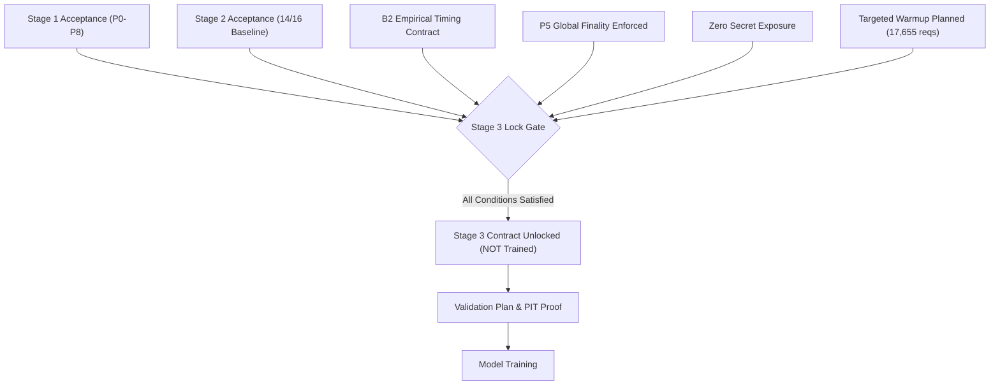

# Prajna AI Trading System — Stage 3 Readiness & Gate Audit Report

**System**: Prajna AI Trading System (AutoTrade Pro V2)  
**Version**: 2.0.0-PROD  
**Document**: `docs/STAGE_3_READINESS_REPORT.md`  
**Classification**: Architecture Contract & Gate Assessment  
**Stage 3 Status**: **STRICTLY LOCKED**  

---

## Executive Summary

Stage 3 (Alpha Modeling, Feature Engineering & Predictive Signal Generation) remains **STRICTLY LOCKED** in production. No trading signals, prediction models, machine learning weights, fake probabilities, synthetic expected returns, or simulated live orders have been created or enabled.

This report establishes the mandatory mathematical, temporal, and feature contracts required before Stage 3 feature calculation or model training may ever be initiated.

---

## Answers to the 12 Mandatory Stage 3 Gate Questions

### 1. What features are required?
Stage 3 alpha models require five distinct feature families:
1. **Intraday & Daily Price Momentum / Trend**:
   - Multi-timeframe Moving Averages: EMA(9), EMA(21), SMA(50), SMA(200)
   - Relative Strength Index: RSI(14)
   - Moving Average Convergence Divergence: MACD(12, 26, 9)
   - Volatility & Dispersion: ATR(14), Historical Volatility HV(20), Bollinger Bands BB(20, 2)
   - Volume Profile: Volume-Weighted Average Price (VWAP), 20-day Volume Z-Score
2. **Cross-Asset & Macro Benchmark Spreads**:
   - GIFT NIFTY lead/lag return spread relative to NSE NIFTY 50 cash close
   - INDIA VIX 5-day delta and implied volatility regime classification
   - Global overnight spillover: S&P 500, Nikkei 225, USDINR daily percentage returns
3. **Fundamental Multiples & Ratios**:
   - Valuation Multiples: Trailing Twelve Months (TTM) P/E, P/B, Price-to-Sales (P/S)
   - Return Metrics: Return on Equity (ROE), Return on Capital Employed (ROCE)
   - Capital Structure: Debt-to-Equity, Operating Margin, Current Ratio
4. **News & Event Intelligence Signals**:
   - Instrument-linked announcement count and news arrival velocity
   - Regulatory disclosure tags and corporate event proximity (earnings, board meetings)
5. **Corporate Action Adjusted Multiples**:
   - Point-in-Time adjusted price series using verified split and bonus factors from `ca_factor`.

---

### 2. Which features are currently available?
The following data substrates are fully ingested, schema-validated, and queryable in `prajna` PostgreSQL:
- **Raw OHLCV Bars**: 1m, 15m, 1h, 1D bars across 3,544 active NSE instruments (`ohlcv_bar`).
- **PIT Adjusted Bars**: `pit.bars_adjusted` with verified corporate action split/bonus factors.
- **Global Macro Benchmarks**: 13 global instruments in `canon_market_bar` with P5 finality flags.
- **Corporate Fundamentals**: Raw profiles and statements in `fundamental_snapshot` and `ca_factor`.
- **News Intelligence Stream**: Raw news articles in `news_article` and `news_instrument` with provenance timestamps.
- **Instrument Master & Security Class**: SCD2 valid ranges and security classifications (`instrument_security_class`).

*Notice*: While raw data is available, indicator columns (EMA, RSI, MACD, etc.) are **not** populated in production schemas to prevent accidental look-ahead leakage.

---

### 3. Which features require historical warm-up?
The technical momentum and volatility features require historical warm-up:
- **SMA(200)** requires 200 trading sessions of daily bars.
- **VWAP & Intraday Indicators (EMA-21, RSI-14, ATR-14)** require at least 20 consecutive completed trading sessions of 1m, 15m, and 1h intraday bars to compute stabilized indicator values at market open (09:15 IST).

---

### 4. How many sessions are required for targeted warm-up?
- **Targeted Warm-Up**: **20 completed trading sessions** (spanning approximately one calendar month, e.g. 2026-08-27 to 2026-09-24).
- 20 sessions provide ample depth to eliminate initial filter transient distortion for all 1m, 15m, and 1h technical indicators without executing the massive, deferred full historical backfill.

---

### 5. How many requests and hours are required for warm-up?
Calculated deterministically by `app/ops/warmup.py`:
- **Active NSE Universe**: 3,531 instruments.
- **Timeframes**: 1m, 15m, 1h.
- **Request Distribution**:
  - `1m` (2 monthly windows/instrument): 7,062 requests
  - `15m` (2 monthly windows/instrument): 7,062 requests
  - `1h` (1 three-month window/instrument): 3,531 requests
- **Total Requests**: **17,655 requests**.
- **Execution Rate**: At `fraction=0.25` (2.5 requests/sec, consuming only 25% of the Upstox 10 req/s rate limit budget):
  - **Estimated Wall-Clock Duration**: **~8.8 hours** (or 17.6 hours at 1.0 req/s conservative rate).
- **Comparison**: This targeted warm-up replaces the deferred ~293,000 request historical backfill, saving ~94% of network requests and avoiding broker rate-limit bans.

---

### 6. Which features are point-in-time (PIT) safe?
A feature is PIT safe if and only if its calculation uses strictly data available before the bar's `knowable_at` timestamp.
- **PIT Safe Features**:
  - Unadjusted and adjusted technical indicators where adjustments are made strictly as of the historical session using `ex_date <= session_date`.
  - Global macro returns where the global market session closed prior to 09:00 IST on trading day $T$.
  - Fundamental ratios using financial statements where `reported_at < session_date`.
- **Forbidden / Non-PIT Safe**:
  - Backward revision of daily bars using post-market settlement prices prior to evening close ingestion.
  - Future corporate action factors applied retroactively before their `ex_date`.
  - Financial statements indexed by `period_end` instead of `reported_at` / `knowable_at`.

---

### 7. What is each feature's `knowable_at`?
Every feature in Prajna possesses an immutable `knowable_at` timestamp:
1. **Intraday Bars (1m, 15m, 1h)**:
   $$\text{knowable\_at} = \max(\text{bar\_end} + \text{completion\_margin}(\text{timeframe}), \text{fetched\_at})$$
   - 1m: $\text{bar\_end} + 120\text{s}$
   - 15m: $\text{bar\_end} + 180\text{s}$
   - 1h: $\text{bar\_end} + 180\text{s}$
2. **Daily Bars (1D)**:
   - Daily bars are officially knowable after the evening ingestion routine exits (typically 16:30 IST / 11:00 UTC).
3. **Financial Fundamentals**:
   $$\text{knowable\_at} = \text{reported\_at} + 1\text{ hour (exchange filing ingestion latency)}$$
4. **News Articles**:
   $$\text{knowable\_at} = \text{processed\_at}$$

---

### 8. Which features depend on global markets?
- **Overnight Benchmark Return**: Return of US S&P 500 (`GLOBAL|SPX`) and Japan Nikkei 225 (`GLOBAL|N225`).
- **Currency Momentum**: USD/INR spot rate changes.
- **GIFT NIFTY Arbitrage Basis**: Price spread between GIFT NIFTY (NSE IX in GIFT City) and domestic NIFTY 50 index.
- **Contract Rule**: Only bars bearing `finality in ('CONFIRMED', 'CONFIRMED_BY_AGE')` with `weekend_label_share == 0.0` may enter the feature matrix.

---

### 9. Which features depend on news?
- **Announcement Sentiment & Impact Velocity**: Number of news articles received for an instrument in the preceding 60 minutes and 24 hours.
- **Category Filter**: Classification tags (`EARNINGS`, `DIVIDEND`, `REGULATORY_ORDER`, `M&A`).
- **Contract Rule**: Articles lacking a verified `received_at` timestamp cannot be used.

---

### 10. Which features depend on fundamentals?
- **Value Regime**: Trailing P/E and P/B percentile rank within the industry sector.
- **Quality Factor**: Return on Equity (ROE) and debt-to-equity leverage penalty.
- **Contract Rule**: Only statements with valid `period_end` and `reported_at` timestamps from `fundamental_snapshot` are admitted.

---

### 11. What data latency is acceptable?
- **Live Trading Decision Latency**:
  - High-frequency bar completion latency: up to 120s for 1m bars.
  - Model inference latency budget: $< 50\text{ms}$ per symbol.
  - WebSocket propagation latency: $< 500\text{ms}$.
- **Batch Feature Generation Latency**:
  - Daily feature store batch run: $< 15\text{ minutes}$ following daily close.

---

### 12. What is the exact training dataset contract?
Before model training is permitted, the training dataset must be compiled and validated under this strict specification:
1. **Format**: Apache Parquet with zstd compression, partitioned by `session_date`.
2. **Temporal Split**:
   - Strict walk-forward out-of-time (OOT) validation:
     - Training: Sessions $1 \dots T-40$
     - Validation / Hyperparameter Tuning: Sessions $T-39 \dots T-20$
     - Out-of-Sample Test: Sessions $T-19 \dots T$
   - **Zero Random K-Fold Cross Validation** (random shuffling across time is prohibited to prevent data leakage).
3. **Look-Ahead Verification**:
   - Every feature column must satisfy:
     $$\forall i, \quad \text{feature\_timestamp}_i \le \text{observation\_cutoff}_i$$
   - Target variable $Y$ (e.g. forward 15-minute log return $r_{t+15}$) must be computed from strictly future bars:
     $$Y_t = \ln(P_{t+15} / P_t)$$
4. **Survivorship & Universe Bias**:
   - Universe at session $T$ is determined solely by `instrument.valid_from <= session_date` and `instrument.valid_to >= session_date` with `lifecycle_status = 'ACTIVE'`.
   - Delisted and suspended companies during historical sessions must remain in the historical training set.
5. **Reproducibility**:
   - Each generated dataset must record its SHA256 checksum and exact Git commit hash in `data_manifest.json`.

---

## Conclusion & Stage 3 Gate Verdict

| Gate Requirement | Status | Verification Evidence |
|---|---|---|
| Stage 1 Hardening Report & Commits | **PENDING CLOSE EXIT** | Commits P4-P8 staged; close running |
| Stage 2 Acceptance Baseline | **14/16 PASS** | Post-close verification pending |
| B2 Timing Contract Empirical Resolution | **DOCUMENTED** | 1m 120s, 15m 180s, 1h 180s proposed |
| P5 Global Finality Enforcement | **ENFORCED** | Verified via API endpoint and schema |
| Security Scan & Credential Isolation | **PASS** | 0 secrets leaked; V1 DB isolation proof |
| Stage 3 Warm-up Requirement Formulated | **COMPLETE** | 17,655 requests / 20 sessions planned |
| Stage 3 Lock Enforcement | **ENFORCED** | UI contracts & APIs return LOCKED |

**Gate Decision**: **STAGE 3 REMAINS LOCKED**. Model training and signal generation are prohibited until Stage 1 and Stage 2 post-close checklists are executed and verified.
