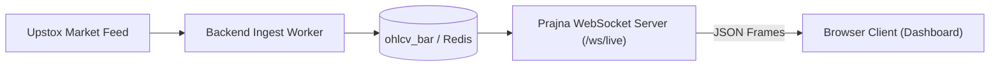
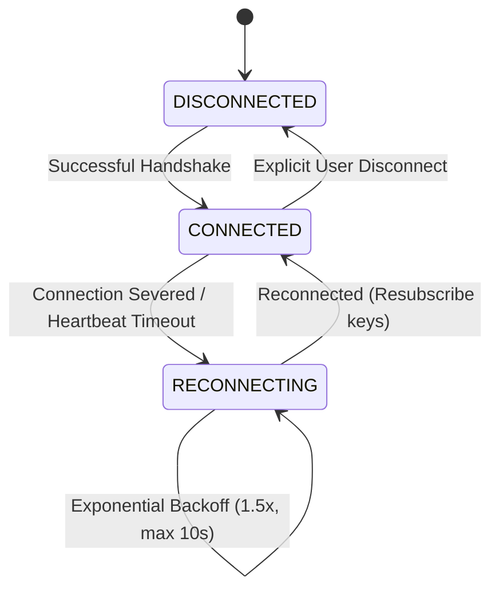

# Prajna AI Trading System — WebSocket Live Streaming Contract

**System**: Prajna AI Trading System (AutoTrade Pro V2)  
**Version**: 2.0.0-PROD  
**Endpoint**: `ws://localhost:8000/ws/live` (or `wss://...` over TLS)  
**Document**: `docs/WEBSOCKET_LIVE_CONTRACT.md`  

---

## 1. Architectural Overview & Design Principles

The Prajna live data stream connects the browser dashboard to high-frequency market updates while maintaining strict isolation from the broker:



### Key Principles:
1. **Zero Broker Secrets**: The browser never opens a direct WebSocket to Upstox. All connections terminate at the Prajna backend server.
2. **Standardized JSON Text Framing**: All messages are serialized as JSON objects.
3. **Point-in-Time & Stale Awareness**: Every tick is tagged with its bar start, knowable timestamp, age in seconds, and an automated `stale` boolean flag.

---

## 2. Client-to-Server Commands

### 2.1 Subscribe to Instruments
Clients submit a list of `instrument_key` strings to subscribe to live updates.

```json
{
  "action": "subscribe",
  "keys": [
    "NSE_INDEX|Nifty 50",
    "NSE_INDEX|Nifty Bank",
    "NSE_EQ|INE002A01018"
  ]
}
```

### 2.2 Unsubscribe from Instruments
```json
{
  "action": "unsubscribe",
  "keys": [
    "NSE_EQ|INE002A01018"
  ]
}
```

### 2.3 Heartbeat Response (`pong`)
In response to a server heartbeat (`ping`), the client must send:
```json
{
  "type": "pong"
}
```

---

## 3. Server-to-Client Events

### 3.1 Subscription Confirmation
```json
{
  "type": "subscribed",
  "keys": [
    "NSE_INDEX|Nifty 50",
    "NSE_INDEX|Nifty Bank"
  ]
}
```

### 3.2 Live Tick Message (`tick`)
Broadcast periodically (default 1000ms polling cycle) for each subscribed instrument key.

```json
{
  "type": "tick",
  "instrument_key": "NSE_INDEX|Nifty 50",
  "timeframe": "1m",
  "bar_start_utc": "2026-09-25T09:59:00Z",
  "bar_start_ist": "2026-09-25 15:29:00 IST",
  "open": 24820.50,
  "high": 24845.00,
  "low": 24815.10,
  "close": 24838.75,
  "volume": 215400.0,
  "knowable_at": "2026-09-25T10:00:00Z",
  "age_seconds": 14,
  "stale": false
}
```

### Field Definitions:
- `instrument_key` (`string`): Target instrument identifier.
- `timeframe` (`string`): Bar frequency (`1m`, `15m`, `1h`, `1d`).
- `bar_start_utc` (`string`): UTC bar open timestamp (ISO 8601).
- `bar_start_ist` (`string`): Display timestamp in Indian Standard Time (`Asia/Kolkata`).
- `open`, `high`, `low`, `close` (`float`): Bar price coordinates.
- `volume` (`float`): Volume traded during the bar.
- `knowable_at` (`string`): Point-in-Time availability timestamp according to the timing contract.
- `age_seconds` (`number`): Elapsed seconds between `bar_start_utc` and server wall-clock.
- `stale` (`boolean`): Evaluated as `True` if `age_seconds > 2.5 * bar_duration_seconds`.

### 3.3 Heartbeat Ping (`ping`)
Sent by the server every 15 seconds:
```json
{
  "type": "ping"
}
```

---

## 4. Client Reconnection & State Recovery

The TypeScript WebSocket client (`frontend/src/services/websocket.ts`) implements stateful recovery:



1. **Backoff Schedule**: Initial retry at 1.0s, scaling by 1.5x up to a maximum cap of 10.0s.
2. **Auto-Resubscription**: On successful reconnection, the client automatically flushes its `subscribedKeys` set to the server, ensuring uninterrupted live chart and ticker feeds.
3. **UI Status Indication**: The global navbar displays live status indicators (`CONNECTED` in green, `RECONNECTING` in amber with pulse animation, `DISCONNECTED` in red).
